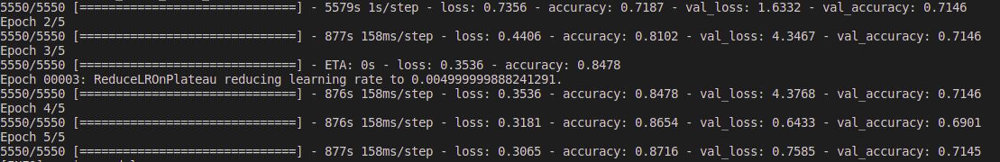

# Efficient-Net
Effcient-net model with histo dataset using tensorflow

### Hyperparameters
   * epochs: 5
   * input shape: (96, 96, 3)
   * batch size: 32,
   * learning rate: 1e-2
   * Data Augmentation: 
     * rescale

### Performance Results

##### Training

##### Learning Curve

### Package Structure

1) **configs:** in configs we define every single thing that can be configurable and can be changed in the future. Good examples are training hyperparameters, folder paths, the model architecture, metrics, flags.

2) **dataloader:** all the data loading and data preprocessing classes and functions live here.

3) **evaluation:** is a collection of code that aims to evaluate the performance and accuracy of our model.

4) **executor:** all the functions and scripts that train the model or use it to predict something in different environments, such as: executors for GPUs, executors for distributed systems. (This package is our connection with the outer world and it’s what our “main.py” will use.)

5) **model:** contains the actual deep learning code (we talk about tensorflow, pytorch etc)

6) **notebooks:** include all of our jupyter/colab notebooks in one place.

7) **ops:** includes operations not related with machine learning such as algebraic transformations, image manipulation techniques or maybe graph operations.

8) **utils:** utilities functions that are used in more than one places and everything that don’t fall in on the above come here.